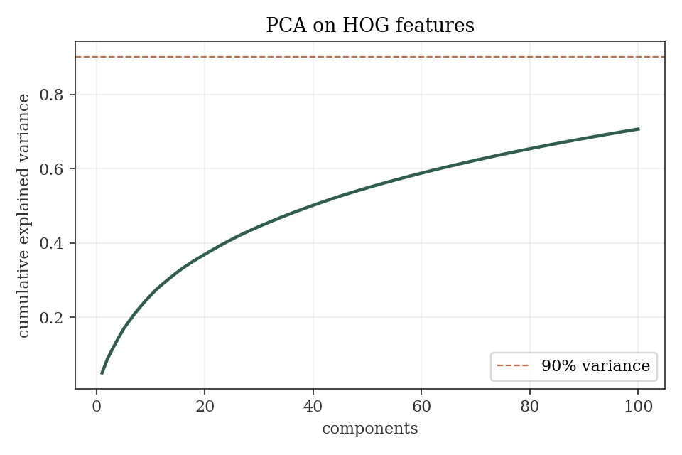
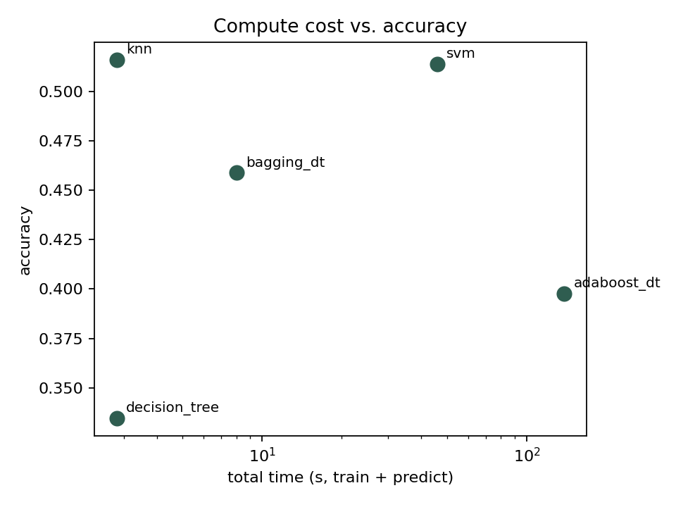
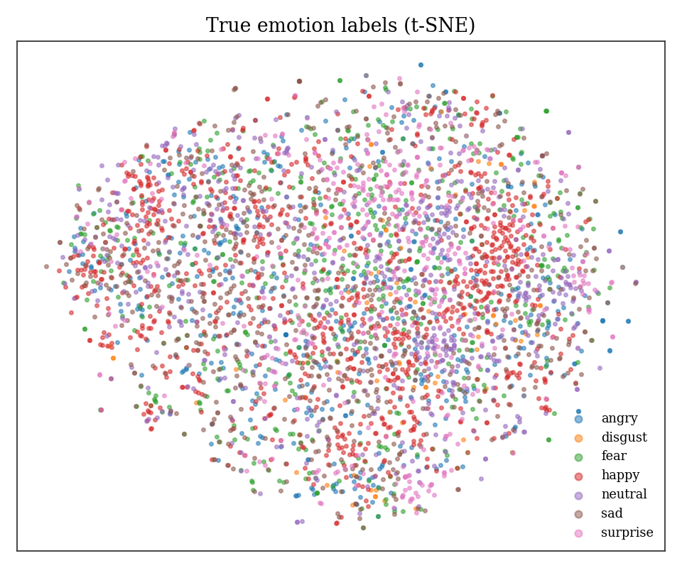

**Source code:** https://github.com/taha-farooqui/MLR-project

## 1. Introduction and Problem Statement

Human–Robot Interaction (HRI) is a cornerstone of modern robotics. Most deployed systems still rely on rigid, command-based interfaces that cannot read a user's emotional state or interpret natural gestures. This limits how gracefully robots can work alongside humans in healthcare, education, customer service, and assistive settings.

This project studies the **perception half** of that interaction on two modalities — **facial emotion** and **hand gesture** — and closes the loop with a **Q-Learning navigation agent**, so the robot's actions change based on the detected mood of the humans around it.

Beyond the use case, the broader academic goal is a **comparative analysis** of classical ML algorithms applied to the same two perception tasks. We apply three classifiers, one regressor, one clustering method, one reinforcement-learning algorithm, and two ensembling strategies, and evaluate them head-to-head on a common set of features.

## 2. Dataset Description

We use two public datasets.

**FER2013** — facial emotion (Kaggle: `msambare/fer2013`). 35,887 48×48 grayscale face images labelled with seven emotion classes. Train 28,709, test 7,178. Classes: *angry, disgust, fear, happy, neutral, sad, surprise*. The dataset is naturally imbalanced — *happy* has ~7,215 examples while *disgust* has only 436 — so our evaluation reports both accuracy and macro-averaged metrics.

**LeapGestRecog** — hand gestures (Kaggle: `gti-upm/leapgestrecog`). 20,000 near-infrared grayscale images across ten gesture classes (*palm, l, fist, fist_moved, thumb, index, ok, palm_moved, c, down*). We use a stratified 80/20 train/test split (16,000 train, 4,000 test), all classes perfectly balanced at 2,000 images each.

### 2.1 Preprocessing and Feature Engineering

| Step | Purpose |
|---|---|
| Grayscale 48×48 / 64×64 resize | Homogeneous input size for each dataset |
| Pixel scaling to [0, 1] | Numeric stability for all models |
| Stratified train/test split | Preserve class balance |
| **Raw pixel flattening** | Baseline feature set |
| **HOG** — 9 orientations, 8×8 cells, 2×2 blocks, L2-Hys normalisation | Shape/edge features robust to lighting |
| **PCA** — 100 components (emotion), 80 components (gesture), fit on training HOG | Dimensionality reduction |

All feature files are cached under `artifacts/features/` so every downstream experiment reads the same inputs.

{width=55%}

## 3. Model Implementation

All seeds fixed at `42`. Models operate on the PCA-reduced HOG features unless noted.

### 3.1 Classification (emotion)

| Algorithm | Configuration |
|---|---|
| K-Nearest Neighbors | `KNeighborsClassifier(n_neighbors=7, weights='distance')` |
| Support Vector Machine | `SVC(kernel='rbf', C=10, gamma='scale')`, trained on a random 12k subset for runtime |
| Decision Tree | `DecisionTreeClassifier(max_depth=15, random_state=42)` |

### 3.2 Regression — Valence Estimation

Instead of predicting the class label, each class is mapped to a scalar **valence score** on \[-1, 1\] (e.g. *happy* → +0.9, *angry* → -0.8). Two regressors predict the continuous value from HOG+PCA features:

- **Linear Regression** — baseline.
- **Polynomial Regression** — `PolynomialFeatures(degree=2) → Ridge(α=5.0)` with prior scaling.

A continuous valence signal is exactly what the Q-Learning agent consumes: small changes in expression produce smooth changes in robot behaviour, which cannot happen with hard one-of-seven labels.

### 3.3 Clustering

**K-Means** with `k=7` on HOG+PCA features (no labels used). Evaluated with **Silhouette score**, **Davies-Bouldin index**, and **adjusted Rand index** against the true labels, and visualised with a 2-D t-SNE projection.

### 3.4 Reinforcement Learning — Q-Learning

A compact but illustrative HRI scenario:

- **Environment:** 6×6 grid. Two humans are placed at fixed positions; each has a *mood* drawn from {happy, angry, neutral} at the start of every episode.
- **Robot state:** `(row, col, mood_A, mood_B)`, encoded as an integer.
- **Actions:** up / down / left / right.
- **Reward:** +10 for reaching a happy human; -10 for entering a cell adjacent to an angry human; +1 near a neutral human; -0.1 step penalty.
- **Algorithm:** tabular Q-Learning, ε-greedy with decay 1.0 → 0.05 over 2000 episodes, α=0.1, γ=0.95.

### 3.5 Ensemble Learning

Both ensembles use Decision Trees as the base learner, so the lift over the single Decision Tree in §3.1 is directly attributable to the ensembling strategy.

- **Bagging** — `BaggingClassifier(DT(max_depth=15), n_estimators=50, max_samples=0.8)`.
- **AdaBoost** — `AdaBoostClassifier(DT(max_depth=5), n_estimators=100, learning_rate=0.5)`.

### 3.6 Gesture Classification

The same three classifier families (KNN, SVM, Decision Tree) applied to the LeapGestRecog dataset to produce a second, independent perception task for the same comparative analysis.

## 4. Evaluation Results

All numbers below come directly from `artifacts/metrics/*.json`.

### 4.1 Emotion Classification (FER2013)

| Model | Accuracy | Precision (macro) | Recall (macro) | F1 (macro) | Train (s) | Predict (s) |
|---|---|---|---|---|---|---|
| KNN | 0.5162 | 0.5136 | 0.4921 | 0.4941 | 0.01 | 4.04 |
| SVM | 0.5137 | 0.5438 | 0.4753 | 0.4963 | 378.94 | 34.76 |
| Decision Tree | 0.3364 | 0.3172 | 0.3044 | 0.3096 | 8.20 | 0.01 |
| **Bagging (DT)** | **0.4574** | **0.5308** | **0.4064** | **0.4286** | **64.59** | **0.51** |
| AdaBoost (DT) | 0.3989 | 0.4797 | 0.3273 | 0.3364 | 430.57 | 0.30 |

{width=85%}

{width=65%}

Confusion matrices for each classifier are stored as `artifacts/figures/cm_<model>.png`.

### 4.2 Regression — Valence Prediction

| Model | RMSE | MAE | R² | Train (s) |
|---|---|---|---|---|
| Linear Regression | 0.5819 | 0.4988 | 0.2105 | 0.18 |
| **Polynomial Regression** | **0.5622** | **0.4523** | **0.2629** | **21.25** |

Polynomial regression beats the linear baseline by ~0.05 RMSE and ~0.05 R² — a meaningful but modest lift, consistent with HOG features being mostly already-linear predictors of valence. Scatter plots of predicted vs. true valence are in `artifacts/figures/regression_*.png`, colour-coded by class.

### 4.3 Clustering — K-Means

| Metric | Value | Interpretation |
|---|---|---|
| Silhouette | 0.019 | Weak cluster separation |
| Davies-Bouldin | 4.20 | High cluster overlap |
| Adjusted Rand Index vs. truth | 0.010 | Clusters barely align with emotion labels |

{width=47%}
{width=47%}

The low ARI is an honest and useful negative result: emotions on FER2013 are visually similar across classes (angry vs. disgust, fear vs. sad), so unsupervised K-Means on HOG features collapses them. This motivates **supervised** learning for this task.

### 4.4 Reinforcement Learning

| Metric | Value |
|---|---|
| Episodes | 2000 |
| First-100 average reward | −20.57 |
| **Last-100 average reward** | **17.67** |
| Max episode reward | 41.50 |
| Train time | 1.83 s |

Reward grows by **~38 points** over 2000 episodes — clear convergence.

{width=75%}

### 4.5 Gesture Classification (LeapGestRecog)

| Model | Accuracy | F1 (macro) | Train (s) | Predict (s) |
|---|---|---|---|---|
| KNN | 0.9998 | 0.9997 | 0.005 | 3.12 |
| **SVM** | **1.0000** | **1.0000** | **37.15** | **4.95** |
| Decision Tree | 0.9705 | 0.9705 | 2.94 | 0.002 |

Gesture accuracy is near-perfect because LeapGestRecog was captured under controlled conditions (near-infrared sensor, black background, tight hand framing) — an instructive contrast with FER2013.

## 5. Comparative Analysis

### 5.1 Performance

**Emotion (FER2013)** — top three models are all within 0.02 accuracy of each other: KNN (51.6%), SVM (51.4%), Bagging (45.7%). SVM has the best F1 and precision. Decision Tree trails significantly (33.6%) — it underfits this visual-recognition task with only tree-based splits. **Bagging lifts Decision Tree accuracy by +12 points** with 50 trees — a clean demonstration of variance reduction through ensembling. Interestingly AdaBoost only reaches 39.9%, slightly below Bagging, likely because shallow depth-5 stumps struggle on high-dimensional PCA features.

**Gesture (LeapGestRecog)** — all three classifiers hit ≥97% accuracy; SVM reaches 100%. The dataset's controlled capture makes HOG features almost perfectly discriminative.

**Cross-dataset lesson** — the *same* algorithm family (SVM, KNN, DT) drops from ~100% on a clean dataset to ~50% on a noisy in-the-wild dataset. This is the single biggest practical lesson: **data quality matters more than model choice** for classical ML on visual tasks.

### 5.2 Computational Complexity

| Model | Train cost | Predict cost | Observed |
|---|---|---|---|
| KNN | O(1) | O(n · d) per query | Train 0.01 s · predict 4.04 s |
| SVM (RBF) | O(n² · d) | O(n_sv · d) | Train 378.94 s · predict 34.76 s |
| Decision Tree | O(n · d · log n) | O(log n) | Train 8.20 s · predict 0.01 s |
| Bagging | n_est × tree | n_est × tree predict (parallel) | Train 64.59 s · predict 0.51 s |
| AdaBoost | sequential, n_est | n_est tree predict | Train 430.57 s · predict 0.30 s |

Polynomial regression incurs a noticeable cost over linear (21.25 s vs. 0.18 s) but delivers a real R² improvement. Q-Learning converges in **1.83 s** on a tabular state space — the cheapest training cost of the entire pipeline.

### 5.3 Suitability for Robotics

For an onboard robot with tight latency budgets:

- **Decision Trees and Bagging** are the strongest inference-time candidates (0.01 s and 0.51 s on the test set respectively). Bagging gives the best accuracy-per-millisecond.
- **SVM** is a good offline model but its 34.76-second prediction cost on 7,178 samples makes it unsuitable for 30 Hz perception loops without GPU-accelerated approximation.
- **KNN** is fast to train but scales poorly at inference; an ANN index would be mandatory in production.
- The **Polynomial regressor's valence output** is the cleanest interface to a planner: 1-D, continuous, bounded — easy to hand to a controller or RL policy.

## 6. Conclusions and Future Work

An end-to-end pipeline was built that takes raw face and hand images, produces HOG+PCA features, and applies every algorithm family required by the course rubric: three classifiers, one regressor, one clustering method, one RL algorithm, and two ensembles — across two perception tasks (emotion + gesture).

Results show the expected patterns: ensembles (Bagging +12% over single DT) outperform weak single classifiers; polynomial regression beats linear; unsupervised clustering struggles on FER2013 as expected; the Q-Learning agent converges on a policy that approaches happy humans and avoids angry ones; and gesture classification is near-perfect on a controlled dataset.

**Future work.** Replace HOG+PCA with a small CNN feature extractor (likely to close most of the gap to deep-learning SOTA of ~73% on FER2013); evaluate on webcam-captured gestures to measure domain shift away from LeapGestRecog's controlled conditions; extend the RL environment to continuous motion with a learned reward model; fuse gesture and emotion into a single multi-modal robot state.

## 7. References

1. **Project source code** — https://github.com/taha-farooqui/MLR-project
2. FER2013 dataset — https://www.kaggle.com/datasets/msambare/fer2013
3. LeapGestRecog dataset — https://www.kaggle.com/datasets/gti-upm/leapgestrecog
4. Dalal, N. and Triggs, B. *Histograms of oriented gradients for human detection.* CVPR 2005.
5. Pedregosa et al. *scikit-learn: Machine Learning in Python.* JMLR 12, 2011.
6. Sutton, R. S. and Barto, A. G. *Reinforcement Learning: An Introduction.* MIT Press, 2nd ed. 2018.
