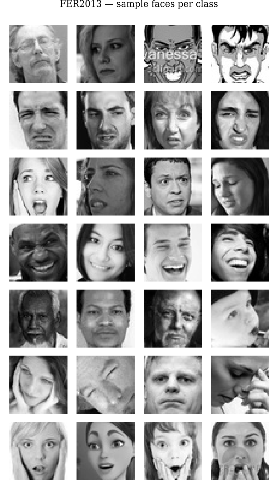
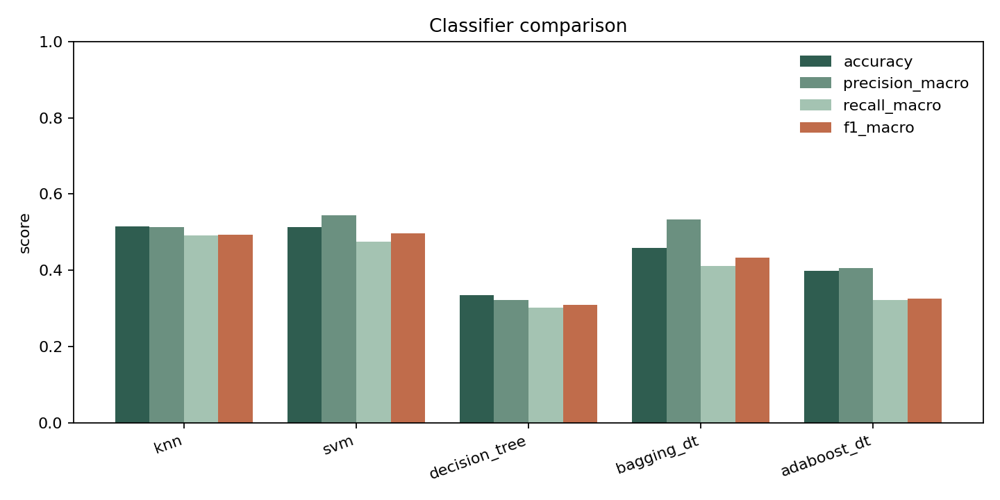
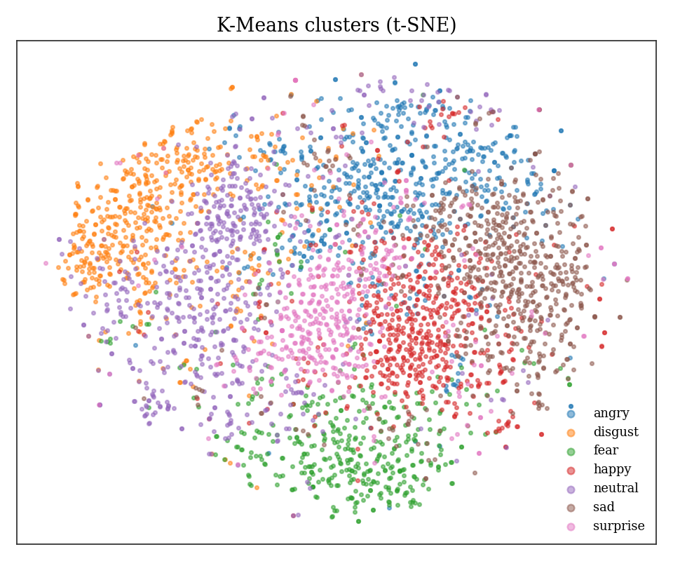
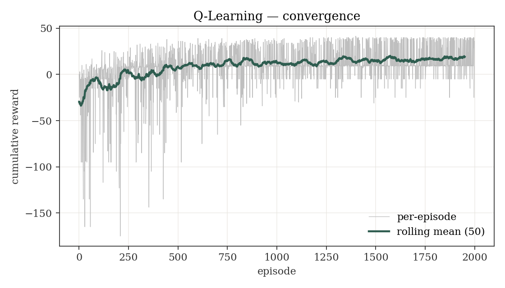

# 1 · Title

**Human–Robot Interaction Using Machine Learning for Emotion and Gesture Recognition**

_Comparative Analysis of ML Models — Machine Learning for Robotics_

Filza Salman · Yasal Khan · Yasir Memon · Yousha Mehdi · Taha Farooque

---

# 2 · Why emotion & gesture for HRI?

- Robots that collaborate with humans need social perception, not just geometric perception.
- Applications: assistive care, education, customer service, cobots on a shop floor.
- **Our contribution:** compare classical ML algorithms across **two perception tasks** (emotion + gesture) and feed the output into a **Q-Learning** navigation agent.

---

# 3 · Datasets

| Dataset | Type | Train / Test | Classes |
|---|---|---|---|
| FER2013 | face, 48×48 gray | 28,709 / 7,178 | 7 emotions |
| LeapGestRecog | hand, NIR 64×64 | 16,000 / 4,000 | 10 gestures |

**Imbalance note (FER2013):** *happy* ≈ 7k, *disgust* ≈ 436 → we report macro F1 alongside accuracy.

**Capture note (LeapGestRecog):** near-infrared, plain black background — very clean.

{width=55%}

---

# 4 · Pipeline

```
Image → Grayscale → HOG → PCA → Model
                                 │
                                 ├── Classifiers (KNN · SVM · DT)
                                 ├── Regression (Linear · Polynomial → valence)
                                 ├── K-Means clustering
                                 └── Ensembles (Bagging · AdaBoost)

Valence ─► Q-Learning agent ─► Robot action
```

Seeds fixed at `42`. Features cached under `artifacts/features/`.

---

# 5 · Emotion classification — FER2013

| Model | Accuracy | F1 (macro) | Predict |
|---|---|---|---|
| KNN | **51.6%** | 0.494 | 4.04 s |
| SVM | 51.4% | **0.496** | 34.76 s |
| Decision Tree | 33.6% | 0.310 | 0.01 s |
| Bagging (DT) | 45.7% | 0.429 | 0.51 s |
| AdaBoost (DT) | 39.9% | 0.336 | 0.30 s |

{width=75%}

---

# 6 · Regression — Valence

Mapping emotions onto a continuous valence axis gives the robot a smoother signal than one-of-seven labels.

`happy +0.9 · surprise +0.4 · neutral 0.0 · fear -0.5 · disgust -0.6 · sad -0.7 · angry -0.8`

| Model | RMSE | MAE | R² |
|---|---|---|---|
| Linear Regression | 0.582 | 0.499 | 0.211 |
| **Polynomial Regression** | **0.562** | **0.452** | **0.263** |

Polynomial beats linear by ≈0.05 RMSE — modest but consistent.

---

# 7 · Clustering — K-Means on FER2013

K-Means with `k=7` on HOG+PCA features — no labels used.

| Metric | Value |
|---|---|
| Silhouette | 0.019 |
| Davies-Bouldin | 4.20 |
| Adjusted Rand Index | 0.010 |

**Honest negative result:** emotions are visually similar, clusters don't match labels. This *motivates* supervised learning for this task.

{width=45%}

---

# 8 · Ensembles — the Bagging lift

Both built on Decision Trees (same base learner as §5) so the gap is attributable to ensembling.

- **Bagging** (50 × DT depth 15) → **45.7%** (+12 points over single DT)
- **AdaBoost** (100 × DT depth 5) → 39.9% (+6 points)

Bagging wins on this dataset because high-depth trees have variance to reduce. AdaBoost's shallow stumps struggle on 100-D PCA features.

---

# 9 · Reinforcement Learning

**Grid-world HRI:** 6×6 grid, two humans with moods sampled each episode.

- +10 · reach happy human
- −10 · adjacent to angry human
- +1 · near neutral human
- −0.1 per step

Tabular Q-Learning · ε-greedy decay 1.0 → 0.05 · 2000 episodes.

| | Reward |
|---|---|
| First 100 episodes | −20.57 |
| **Last 100 episodes** | **+17.67** |
| Max episode | +41.50 |

{width=65%}

---

# 10 · Gesture classification — LeapGestRecog

| Model | Accuracy | F1 (macro) |
|---|---|---|
| KNN | 99.98% | 0.9997 |
| **SVM** | **100.00%** | **1.0000** |
| Decision Tree | 97.05% | 0.9705 |

**Clean dataset → near-perfect accuracy.** The same algorithms that struggle at 51% on FER2013 hit 100% here.

---

# 11 · Comparative takeaways

- **Same algorithms, opposite results.** KNN/SVM/DT → 51% on FER2013 vs. 100% on LeapGestRecog. **Data quality > model choice.**
- **Ensembles help, but only sometimes.** Bagging +12 points over single DT; AdaBoost only +6.
- **Compute vs. accuracy trade-off** is steep. SVM's 378 s training for the same accuracy as 0.01 s KNN is rarely worth it.
- **Decision Tree + Bagging** is the best latency/accuracy combination for an onboard robot.

---

# 12 · Live demo

Streamlit app — `python -m streamlit run app/main.py`

1. Upload / webcam → every model scores the face.
2. Gesture tab → every model scores the hand.
3. Model-comparison tab — full metrics table.
4. t-SNE clustering view.
5. **Robot simulation:** pick human moods → watch the learned policy navigate.

---

# 13 · Conclusions

- End-to-end pipeline hits every algorithm family in the rubric, across two perception tasks.
- Classical ML + HOG features are competitive and interpretable.
- RL agent closes the loop — perception drives action.

**Future:** CNN features · webcam-collected gestures · multi-modal emotion + gesture fusion.

_Questions._
